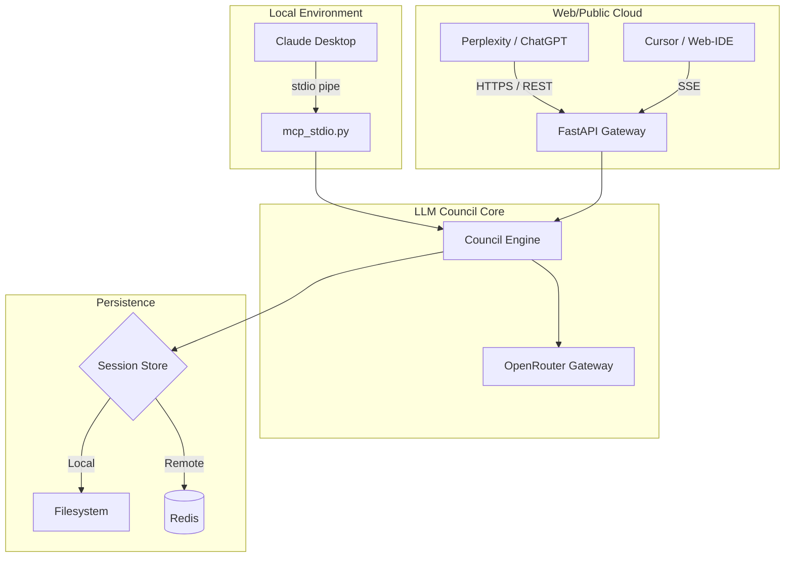

# Roadmap: Universal Council Gateway (MCP + REST/OpenAPI)

This document outlines the strategic plan for refactoring `llm-council` from a local-only MCP server into a hybrid service capable of serving local IDEs (Claude Desktop/Cursor) and web-based AI services (ChatGPT Actions, Perplexity Tools, DeepSeek) simultaneously.

## 1. High-Level Architecture

The goal is to maintain one **Engine** with multiple **Entrypoints** (Doors).

---

## 2. Shared Core Refactor

Currently, logic is slightly coupled to the MCP `Context`. We need a clean separation:

- **`llm_council/core/engine.py`**: Pure Python logic. No MCP, no HTTP. Returns plain dictionaries or Pydantic models.
- **`llm_council/core/sessions.py`**: Swappable storage via a `SessionManager` interface.
    - `LocalFileStorage`: For stdio use.
    - `RedisStorage`: For web-gateway use (**Persistence Fix**). Cloud platforms (Vercel/Docker) use ephemeral filesystems; Redis ensures stage 1 and stage 2 data survives across stateless HTTP requests.

## 3. The Universal Bridge Strategy

The "Universal Bridge" ensures tools are platform-independent.

### Action-Agnostic Schemas
We will use **Pydantic** models to define request/response contracts.
- **Input**: Validated by the same model whether it comes from MCP `json-rpc` or a ChatGPT `POST` body.
- **Output**: Serialized to the format required by the caller.

### Protocol Translation Layer
A thin middleware layer handles protocol "handshakes":
- **MCP**: Handles `list_tools` mapping.
- **OpenAPI**: FastAPI auto-generates `openapi.json` for ChatGPT/Perplexity discovery.

---

## 4. Entrypoints (The Doors)

### Door A: `mcp_stdio.py` (Claude Desktop)
Minimal wrapper around `FastMCP(transport="stdio")`.
- **Protocol**: JSON-RPC over `stdin`/`stdout`.
- **Auth**: Implicit (local machine).

### Door B: `http_gateway.py` (FastAPI Web Gateway)
Serves as an ASGI/WSGI app listening on a port (e.g., 8000).
1. **Transport Layer Transition (SSE)**: Uses `mcp-server-sse` to serve the MCP protocol over HTTP/SSE.
2. **Standard REST**: Provides direct HTTP endpoints for Perplexity Actions.

---

## 5. Connectivity & Discovery

To make the server reachable by Perplexity or ChatGPT, we use one of two paths:

*   **Path 1: The "Home Server" (Tunnel)**: Run the server locally and use `cloudflared` or `ngrok` to provide a public URL (e.g., `https://council-gate.trycloudflare.com`).
*   **Path 2: The "Cloud Native" (Hosted)**: Deploy as a container to **Fly.io**, **Railway**, or **Render**.
*   **Discovery**: Point Perplexity to `https://your-url/openapi.json`. It will "discover" tool methods as standard REST endpoints.

---

## 6. Security & Authorization

Unlike `stdio`, the web gateway is public and requires protection:
- **API Key Protection**: Implement a `X-Council-Auth` header. Perplexity/ChatGPT will store this as a "Secret" or "Bearer Token" in the tool configuration.
- **CORS**: Restrict cross-origin requests to trusted AI platform domains or specific browser-agent origins if used directly.
- **Key Isolation**: The gateway "Guards" the `OPENROUTER_API_KEY`. It only forwards requests once the `X-Council-Auth` key is verified.

---

## 7. Handling Latency (30s Timeouts)

Council runs take 45-90 seconds, but web tools (Perplexity/ChatGPT) often timeout after **30s**.

- **Strategy**: Lean into the 3-stage flow.
- **Async Execution**: 
    1. Perplexity calls `POST /start_council`. 
    2. Gateway starts orchestration in the background and returns a `session_id` **immediately**.
    3. Perplexity then polls `GET /status/{session_id}` or calls the next stage.
- **Result**: No HTTP timeouts, and the user sees progress updates in the AI's "Thinking" block.
